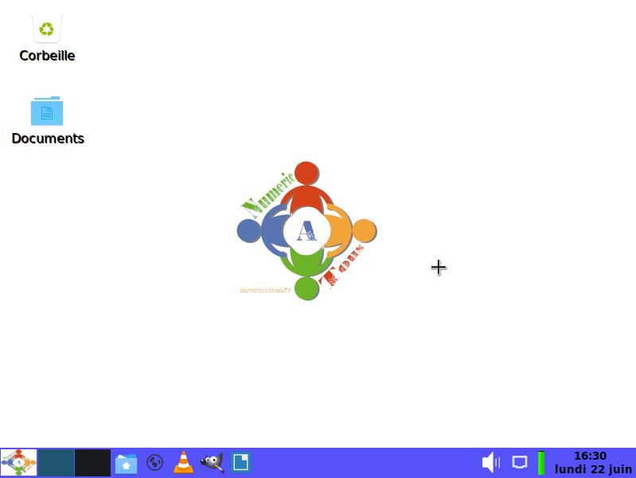

# natos
## Distribution Linux simple et légère pour débutants  
## Numericatous OS  

Créée à partir de l'outil **live-build**, NATOS est une distribution Linux légère, basée sur **Debian** Buster utilisant l'environnement de bureau **LXDE**.  

Le but est d'avoir un système léger qui puisse fonctionner correctement même sur un ordinateur un peu ancien, avec les principaux outils utiles au quotidien.  

Développé par **Numericatous**  
[Numericatous](https://numericatous.fr)  

La version **0.1** est une version **beta**, ne pas utiliser en production.

